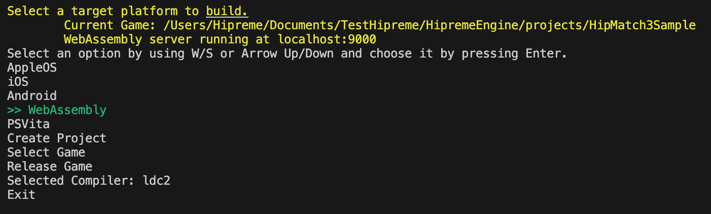

<h1 align="center">
<a href="https://github.com/MrcSnm/HipremeEngine/wiki/Getting-Started">Getting Started</a>
</h1>

The engine maintains  some global options which you can modify it on source/global/opts.d:
- HE_DEBUG    -> Use that for creating a debug version for the engine only
- HE_NO_LOG   -> Disable the global logging functions
- HE_ERR_ONLY -> Maintain only error logging

## Current features

- Input handler and text input with selected keyboard layout;
- Xbox One/Series Gamepad implementation;
- Minimal Matrix/Vector implementation;
- Asset packing, appending, updating and reading for faster performance(less IO);
- Multi threaded asset loading and decoding (image).

## Platforms
> Almost all of those platforms can be built by using the [hbuild](tools/user/hbuild) project.
>
> If you have D installed already, the hbuild can be got by running `dub run hipreme_engine:hbuild`
>
> If not, you may go to the [BuildAssets](https://github.com/MrcSnm/HipremeEngine/releases/tag/BuildAssets.v1.0.0) page and select your system. Both the language and engine will be installed locally by using them.

## Build System Showcase

- Xbox Series (UWP): [build/uwp](build/uwp/HipremeEngine/HipremeEngine)
- Android: [build/android/](build/android/project/)
- Browser (WebAssembly): [build/wasm](build/wasm)
- PS Vita: [build/vita](build/vita/hipreme_engine/)
- MacOS : [build/appleos](build/appleos/)
- iOS: [build/appleos](build/appleos/)
- Windows: [bin/desktop](bin/desktop/)
- Linux: [bin/desktop](bin/desktop/)
> Requires libgl1-mesa-dev for opening X11 window and OpenGL

### Features

1. Simple build system
2. Virtual File System
3. Centralized asset locator with caching
4. File reading with progress notification

## Rendering

- Metal 2.4
- Direct X 11
- OpenGL 3
- OpenGL ES 3
- OpenGL ES 2
- WebGL 1.0 (OpenGL ES 2 emulated)
- HipRenderer (abstraction)
  
### Features

1. Sprite
2. SpriteBatch
3. GeometryBatch
4. FrameBuffer
5. BitmapText
7. Shader
8. Material
9. Tiled maps

## Audio
- AVudioEngine
- OpenSL ES
- OpenAL
- XAudio2
- WebAudio
- HipAudio (abstraction)

### Features

1. Streaming
2. 3D audio
3. Low Latency on Android -> See flags at config/opts.d `HIP_OPENSLES_OPTIMAL` and `HIP_OPENSLES_FAST_MIXER`

## Decoding

- Images: PNG, JPG, BMP, TIFF and maybe others via arsd-official:image_files
- Audio: MP3, OGG, WAV, FLAC via audioformats
- Tiled: TSX and TSJ parser
- TextureAtlas: JSON, ATLAS, XML and TXT(Spritesheet) parser
- Font: FNT, TTF, OTF
- Pack: HapFile(Hipreme Asset Packing File)
- Settings: INI/CONF, JSON (HipremeEngine own's implementation that simulates std.json but faster) and CSV

### Coding

- Scripting:

1. D ( check api module for reference )
- Filewatcher for recompiling the script
- WebAssembly server reloader
- Live reload ( no engine restart for coding )
    > State is not saved, it is a simple restart, but all the assets are also cached, so, it is still way faster than reopening. 

2. Lua (outdated)
- May be subject to removal
  

## Next steps

- GLSL to HLSL transpiler
- Multi threaded audio decoding (currently only single threaded is supported)
- Create a proof of concept

## Issues list

- You can't spawn an Object from within an interface without calling `hipSaveRef` or `GC.addRoot`. This is a bug
on DLL implementation which doesn't actually add the new object spawned from an interface as a leaf.
